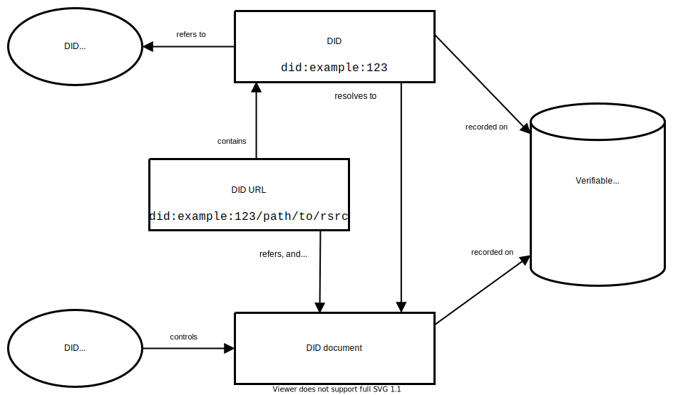

# SSI Framework Onboarding
Con la **Identidad Auto-Soberana** (en Inglés Self-Sovereign Identity (SSI)), los titulares de la identidad individual crean y controlan completamente sus credenciales, sin verse obligados a solicitar autorización de una autoridad intermediaria o centralizada y les da control sobre cómo se comparten y usan sus datos personales.

El usuario tiene un medio para generar y controlar identificadores únicos, así como alguna facilidad para almacenar datos de identidad.

En el paradigma de la identidad centralizada, una entidad externa proporciona la identidad de una persona. En el paradigma descentralizado de identidad, el usuario está en el centro del marco y no hay necesidad de que terceros emitan y administren una identidad.

La **Identidad AutoSoberana** (Self-Sovereign Identity en inglés) es un nuevo paradigma para la generación de confianza en internet que trasciende las interacciones digitales y puede implementarse en el mundo físico. 
Un ejemplo de modelo de SSI es QuarkId ( https://quarkid.org/ ) que está trayendo el mundo de SSI a la realidad en Latinoamérica.


Los Identificadores Descentralizados (Decentralised IDs o DIDs) y las Credenciales Verificables (Verified Credencials o VCs) son los pilares del modelo Self-sovereign identity (SSI). A través de una serie de pasos vamos a recorrer materiales y workshops que una empresa puede utilizar para integrarse a un modelo de SSI de forma simple sin tener que preocuparse de la problemática tecnológica de fondo.

## DID
Los identificadores descentralizados (DID) son un nuevo tipo de identificador que permite una identidad digital verificable y descentralizada. Un DID se refiere a cualquier sujeto (por ejemplo, una persona, organización, cosa, modelo de datos, entidad abstracta, etc.) según lo determine el controlador del DID. A diferencia de los identificadores federados típicos, los DID se han diseñado para que puedan desvincularse de los registros centralizados, los proveedores de identidad y las autoridades de certificación. El diseño permite que el controlador de un DID brinde control sobre él sin requerir el permiso de ninguna otra parte. Los DID son URI asociados a un sujeto y junto con un DID Document permite interacciones confiables asociadas a ese sujeto.


El DID anterior resuelve el siguiente DID Document. Un DID Document contiene información asociada con el DID, como formas de autenticar criptográficamente al controlador del DID.

```
{
  "@context": [
    "https://www.w3.org/ns/did/v1",
    "https://w3id.org/security/suites/ed25519-2020/v1"
  ]
  "id": "did:example:123456789abcdefghi",
  "authentication": [{
    
    "id": "did:example:123456789abcdefghi#keys-1",
    "type": "Ed25519VerificationKey2020",
    "controller": "did:example:123456789abcdefghi",
    "publicKeyMultibase": "zH3C2AVvLMv6gmMNam3uVAjZpfkcJCwDwnZn6z3wXmqPV"
  }]
}
```

Decentralized Identifiers are a component of larger systems, such as the Verifiable Credentials ecosystem [VC-DATA-MODEL], which influenced the design goals for this specification. The design goals for Decentralized Identifiers are summarized here.


| Goal              | Description
|-------------------|-------------
| Decentralization  | Eliminar el requisito de autoridades centralizadas.
| Control           | Otorga a las entidades el poder de controlar directamente sus identificadores digitales sin la necesidad de depender de autoridades externas.       
| Privacy           | Permitir que las entidades controlen la privacidad de su información, incluida la divulgación mínima, selectiva y progresiva de atributos u otros datos. (selective disclosure)
| Proof-based       | Permite que los controladores del DID proporcionen pruebas criptográficas al interactuar con otras entidades. 
| Discoverability   | Permite que las entidades descubran DID para otras entidades, para obtener más información o interactuar con esas entidades.
| Interoperability  | Utiliza estándares interoperables para que la infraestructura DID pueda hacer uso de las herramientas y bibliotecas de software existentes diseñadas para la interoperabilidad.
| Portability       | Es independiente del sistema y de la red y permite que las entidades utilicen sus identificadores digitales con cualquier sistema que admita DID y métodos DID.
| Simplicity        | Tecnología fácil de entender, implementar y desplegar.
| Extensibility     | Siempre que sea posible, permite la extensibilidad siempre que no impida en gran medida la interoperabilidad, la portabilidad o la simplicidad.

## Visión General de la Arquitectura


### DIDs and DID URLs
Un identificador descentralizado, o DID, es un URI compuesto por tres partes: el esquema did:, el identificador del DID Method y un identificador único específico dado por el DID Method. Los DID pueden resolver un DID Document.

### DID subjects
El sujeto de un DID es, por definición, la entidad identificada por el DID. El sujeto del DID también podría ser, a su vez, el controlador DID. Cualquier cosa puede ser sujeto del DID: una persona, grupo, organización, cosa o concepto.

### DID controllers
El controlador de un DID es la entidad (persona, organización o software autónomo) que tiene la capacidad, según lo define un método DID, para realizar cambios en un documento DID. Esta capacidad generalmente se afirma mediante el control de un conjunto de claves criptográficas utilizadas por el software que actúa en nombre del controlador, aunque también se puede afirmar a través de otros mecanismos. Tenga en cuenta que un DID puede tener más de un controlador, y el sujeto DID puede ser el controlador DID o uno de ellos.

### Verifiable data registries
Para que se puedan resolver en documentos DID, los DID generalmente se registran en un sistema subyacente o en una red de algún tipo. Independientemente de la tecnología específica utilizada, cualquier sistema que admita el registro de DID y la devolución de los datos necesarios para producir documentos DID se denomina Verifiable Data Registries.

### DID documents
Los documentos DID contienen información asociada con un DID. Por lo general, expresan métodos de verificación, como claves públicas criptográficas y servicios relevantes para las interacciones con el sujeto DID.

### DID methods
Los DID Methods son el mecanismo mediante el cual se crea, resuelve, actualiza y desactiva un tipo particular de DID y su DID Document asociado.

### DID resolvers and DID resolution
Un DID Resolver es un componente del sistema que toma un DID como entrada y produce un documento DID conforme como salida. Este proceso se denomina DID Resolution.

## Trust Over IP
